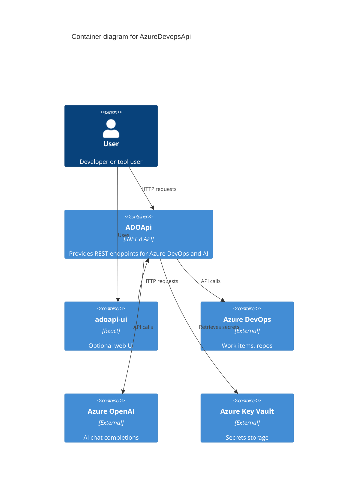
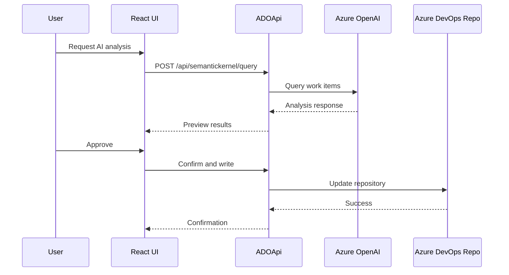
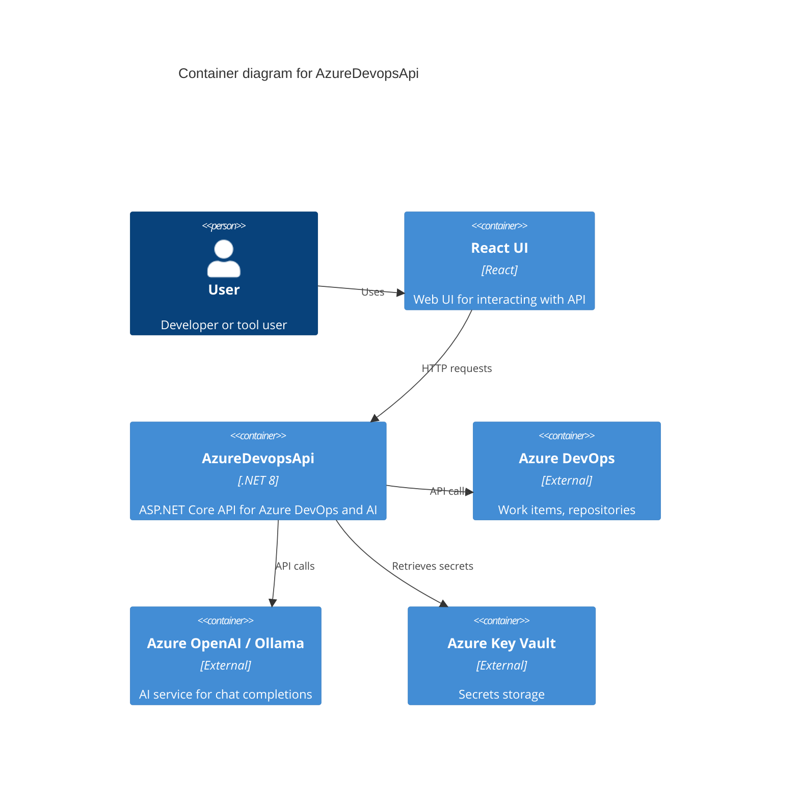
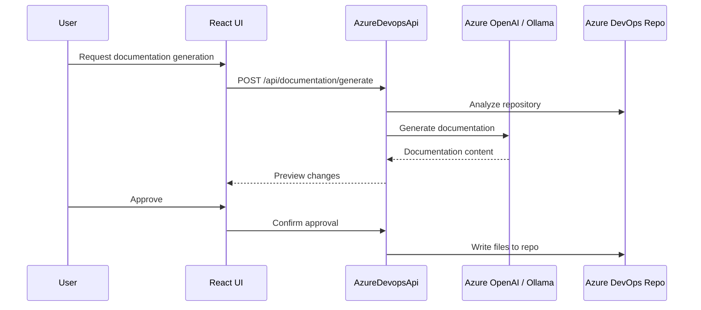

# Architecture

This document describes the implemented architecture of AzureDevopsApi, a .NET 8 ASP.NET Core API for Azure DevOps operations and AI integration.

## Architectural Overview

The system follows a layered architecture with controllers handling HTTP requests, services containing business logic, and dependency injection managing external dependencies. Requests flow from clients through controllers to services, which interact with Azure DevOps SDK and Azure OpenAI. Caching and resilience mechanisms are integrated for performance and reliability.

## Components

### Controllers

Handle HTTP requests and responses. Map routes to service methods, perform input validation, and return JSON. Examples: `RepositoryController` for file operations, `WorkItemController` for CRUD on work items, `SemanticKernelController` for AI queries.

### Services

Contain business logic. Interact with external APIs via injected clients. Examples: `RepositoryService` calls GitHttpClient, `WorkItemService` uses WorkItemTrackingHttpClient, `SemanticChatService` wraps Kernel for AI.

### Interfaces

Define contracts for services and external clients, enabling dependency injection and testing. Examples: `IRepositoryService`, `IWorkItemService`, `ISemanticChatService`.

### Utilities

Provide cross-cutting concerns. Examples: `GlobalExceptionHandler` for error mapping, `RateLimitingMiddleware` for throttling, `SwaggerAuthorizeOperationFilter` for OAuth in docs.

### Models

Data transfer objects for requests/responses. Examples: `WorkItemFilterRequest`, `UpdateWorkItemModel`, `WorkItemDetails`.

### Exceptions

Custom exceptions for error handling. `AzureDevOpsApiException` includes HTTP status codes for consistent responses.

## Data Flow

Requests enter via controllers, which validate inputs and call services. Services use injected clients (e.g., VssConnection for Azure DevOps) to make external calls. Responses are cached in-memory via `ICachingService`. AI queries sanitize inputs, batch work items, and call Semantic Kernel. Errors are caught by global middleware and mapped to HTTP codes.

## External Dependencies

- **Azure DevOps SDK**: Microsoft.TeamFoundationServer.Client for work items, repos, projects. Authenticated via PAT in VssConnection.
- **Azure OpenAI**: Via Microsoft.SemanticKernel for chat completions. Requires API key and endpoint.
- **Azure Key Vault**: For secrets in production, accessed via Azure.Identity.DefaultAzureCredential.
- **Azure AD**: For JWT authentication via Microsoft.Identity.Web.

## Security Boundaries

- **Authentication**: JWT Bearer tokens validated by middleware; fallback policy requires authenticated users.
- **Authorization**: Role-based policies (e.g., "ADO.ReadOnly") on controllers/endpoints.
- **Input Sanitization**: Regex in `SemanticKernelController` removes HTML, control chars, and directive phrases.
- **Secrets**: Stored in Key Vault (prod) or user-secrets (dev); startup validates presence.
- **Rate Limiting**: Middleware throttles requests by IP.

## Known Limitations

- Caching is in-memory only; not distributed, so scales poorly across instances.
- Async methods in services lack await, running synchronously and blocking threads.
- No distributed tracing or metrics; logging is text-based.
- AI responses enforce JSON but rely on model compliance; no additional validation.
- Optimistic concurrency requires client-provided IDs but maps conflicts manually.

## Diagrams

### C4 Container Diagram

### Sequence Diagram

### C4-Style Container Diagram

### Sequence Diagram for Documentation Generation

